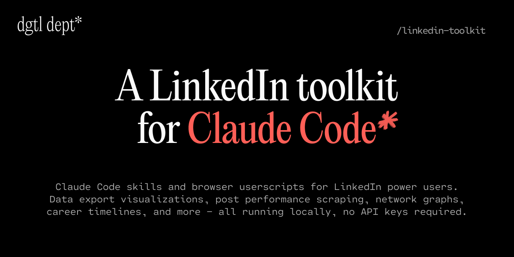

<div align="center">



<br>
<br>

# LinkedIn Toolkit

**Claude Code skills and browser userscripts for LinkedIn data analysis, career visualization, and live metrics capture.** Turn a LinkedIn data export into interactive dashboards, network graphs, and career timelines — or capture your post analytics as you browse. All from your terminal and your browser, no servers.

<br>
<br>

[](https://docs.anthropic.com/en/docs/claude-code)
[](https://python.org)
[](https://linkedin.com/in/rebeccaraebarton)
[](https://x.com/rebeccarae)
[](https://dgtldept.substack.com/welcome)
[](https://rebeccaraebarton.com)
[](https://github.com/thatrebeccarae/linkedin-toolkit/stargazers)
[](LICENSE)

<br>

```bash
git clone https://github.com/thatrebeccarae/linkedin-toolkit.git
```

<br>

**Works on Mac, Windows, and Linux.**

<br>
<br>

[Live Demo](https://thatrebeccarae.github.io/linkedin-toolkit/) · [Why I Built This](#why-i-built-this) · [Who This Is For](#who-this-is-for) · [Getting Started](#getting-started) · [Skills](#skills) · [Userscripts](#userscripts) · [Related Projects](#related-projects) · [License](#license)

</div>

---

## Why I Built This

LinkedIn gives you a data export, but no tools to make sense of it. You get CSVs full of connections, messages, invitations, and inferences — but no way to see patterns, identify blind spots, or understand how your network actually works.

I wanted to answer questions like: Who should I be talking to more? Is posting actually driving connection growth? Which parts of my network are strongest? LinkedIn's own analytics don't go deep enough, and most third-party tools want your login credentials.

**LinkedIn Toolkit keeps everything local.** Your data never leaves your machine. Claude Code runs the analysis, Python generates the visualizations, and you open the results in your browser. No servers, no accounts, no API keys required.

## Who This Is For

- **Professionals** who want to understand their LinkedIn network beyond surface-level stats
- **Job seekers** who want to identify warm connections at target companies
- **Content creators** who want to know if posting actually drives growth
- **Posters** who want their LinkedIn post metrics auto-exported to a spreadsheet or webhook
- **Career changers** who want to visualize their professional evolution
- **Anyone** who requested a LinkedIn data export and has no idea what to do with it

## Getting Started

```bash
git clone https://github.com/thatrebeccarae/linkedin-toolkit.git
cp -r linkedin-toolkit/skills/linkedin-data-viz/ ~/.claude/skills/
```

Then open Claude Code and say: **"Analyze my LinkedIn data export"**

The skill walks you through a wizard: locating your export, previewing your data, selecting a theme, and generating visualizations. No configuration needed.

<details>
<summary><strong>Don't have a LinkedIn data export yet?</strong></summary>

1. Go to [LinkedIn Settings > Data Privacy](https://www.linkedin.com/mypreferences/d/download-my-data)
2. Click **Get a copy of your data**
3. Select **all categories** (or at minimum: Connections, Messages, Invitations, Company Follows)
4. Click **Request archive** — LinkedIn emails you a download link within ~24 hours
5. Download and unzip the archive

</details>

### Prerequisites

- Python 3.9+ (no pip installs needed — stdlib only)
- Claude Code with skills support
- Tampermonkey (Chrome/Firefox/Safari) — only if you want the userscript

## Skills

### [LinkedIn Data Viz](skills/linkedin-data-viz/) — 10 Interactive Visualizations

<div align="center">

[](https://thatrebeccarae.github.io/linkedin-toolkit/)

</div>

Turn a LinkedIn data export into a complete visual analysis:

| Visualization | What It Shows |
|--------------|---------------|
| **Network Universe** | D3.js force-directed graph of connections clustered by role |
| **Inferences vs Reality** | LinkedIn's algorithmic guesses about you vs actual data |
| **High-Value Messages** | Unanswered messages ranked by potential value |
| **Company Follows** | Followed companies grouped by industry |
| **Inbound vs Outbound** | Connection request patterns over time |
| **Connection Quality** | Relationship depth analysis (Active / Dormant / Never Messaged) |
| **Connection Timeline** | Recent connections with engagement data |
| **Inbox Quality** | Genuine conversations vs noise over time |
| **Does Posting Work?** | Posting frequency correlated with connection growth |
| **Career Strata** | Your network as geological layers by career phase |

Plus a unified dashboard linking all visualizations together.

All data stays local. No API keys. No servers. Just Python, your browser, and your LinkedIn export.

<details>
<summary><strong>Sanitize for sharing</strong></summary>

Want to share your visualizations publicly? The built-in sanitizer replaces real names and companies with plausible fakes — all patterns stay intact but your contacts' privacy is protected.

</details>

## Userscripts

### [LinkedIn Metrics Collector](userscripts/) — Passive post analytics capture

A Tampermonkey userscript that quietly captures your LinkedIn post analytics as you browse your own analytics pages — impressions, reactions, comments, shares, the whole breakdown — and saves them locally or posts them to any webhook you control (n8n, Zapier, a Cloudflare Worker, your own server). No login, no scraping, nothing your browser wasn't already fetching.

It doesn't log in for you, doesn't touch other users' data, doesn't use a headless browser. It only reads API responses LinkedIn is already serving to your own browser, and stores them somewhere you can actually use them. GDPR Art. 20 data portability, own data only.

**[Install + webhook setup →](userscripts/README.md)**

## Related Projects

If LinkedIn Toolkit works on *your own data export*, [stickerdaniel/linkedin-mcp-server](https://github.com/stickerdaniel/linkedin-mcp-server) works on *live LinkedIn while you're logged in*. It's a Model Context Protocol server that gives Claude (and other MCP clients) read access to profiles, companies, jobs, your feed, and your inbox via your browser session — plus optional write tools for connection requests and messages. Apache 2.0, actively maintained, with an independent MCPSafe AIVSS security score of 89/100 (Grade B).

Different scope, different tradeoffs. Worth knowing before you reach for it:

- **Browser session, not the official LinkedIn API.** It reads what your own browser already sees. No app review or developer credentials needed — but it operates outside LinkedIn's official APIs and may conflict with the LinkedIn User Agreement. Your call.
- **`get_my_profile` exposes private "private to you" analytics** — profile views, post impressions, search appearances, your Open-to-Work status. Anything with session access can read these. Consider this before granting tool access to any MCP client.
- **Slug ≠ display name.** `get_company_profile("anthropic")` returns a 10-person VC fund, not the AI lab (whose slug is `anthropicresearch`). The tool returns the wrong entity cleanly with no error — call `search_companies` first if you don't know the slug.
- **Write tools** (`connect_with_person`, `send_message`) require explicit confirmation flags but still touch real human inboxes. Use deliberately.

For *your own data, fully local, no session risk*, this toolkit is the answer. For *live read access to LinkedIn from inside Claude*, that one is.

## Contributing

Bug reports, documentation fixes, and new skill ideas are welcome. Please open an issue first for new skills so we can discuss scope and approach.

## License

MIT License. See [LICENSE](LICENSE) for details.

<div align="center">

---

**Your LinkedIn data, visualized.** Install the skill. Say "analyze my LinkedIn data export." See your network clearly for the first time.

</div>
