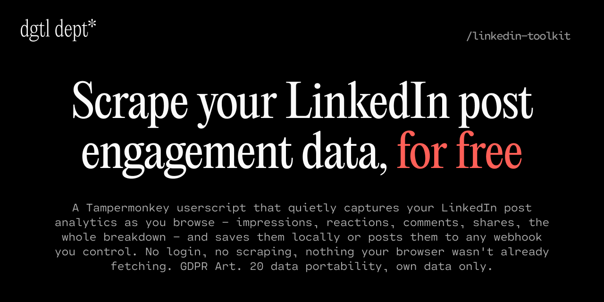

<div align="center">



</div>

# LinkedIn Userscripts

Tampermonkey userscripts for collecting your own LinkedIn data in compliance with GDPR Art. 20 (data portability). Each script runs locally in your browser, never sends credentials anywhere, and only touches data LinkedIn already shows you on pages you visit.

## Scripts

### `linkedin-metrics-collector.user.js`

Passively intercepts LinkedIn's analytics API responses as you browse your own analytics pages, captures post-level impressions/reactions/comments/shares, stores the results in `localStorage`, and optionally POSTs a JSON payload to a webhook of your choice.

**What it collects**
- Post-level metrics: impressions, reactions (with breakdown), comments, shares, engagements, link clicks
- Summary metrics: total impressions, percent change, time range
- Post metadata: activity ID, context description, post URL

**What it does NOT do**
- Doesn't log in for you, scrape connections, or touch other users' data
- Doesn't use a headless browser or automate clicks
- Doesn't make extra API calls — it only reads responses LinkedIn is already serving to your own browser

## Installation

1. Install [Tampermonkey](https://www.tampermonkey.net/) in your browser.
2. Open Tampermonkey's dashboard → **Create a new script**.
3. Paste the contents of `linkedin-metrics-collector.user.js` and save.
4. Visit `https://www.linkedin.com/analytics/creator/content/` and change the time range — you should see a toast in the bottom-right confirming capture.

## Optional: Remote sync to a webhook

By default, the script saves captured metrics to `localStorage` and exposes an **Export Metrics JSON** button that downloads the full history as a JSON file.

If you'd like captured data to POST automatically to a webhook (n8n, Zapier, a Cloudflare Worker, your own server, etc.), configure the URL once via Tampermonkey's storage:

1. Tampermonkey dashboard → **LinkedIn Metrics Collector** → **Storage** tab
2. Add a new entry:
   - **Key:** `LI_METRICS_WEBHOOK_URL`
   - **Value:** `https://your-webhook-endpoint.example/path`
3. Reload your LinkedIn analytics page.

The script posts a JSON body of the form:

```json
{
  "source": "linkedin-metrics-userscript",
  "version": "2.2.0",
  "collectedAt": "2026-04-10T12:34:56.000Z",
  "pageUrl": "https://www.linkedin.com/analytics/creator/content/",
  "summary": { "totalImpressions": 12345, "impressionsPctChange": 0.08, "timeRange": "Past 7 days" },
  "posts": [
    { "activityId": "7...", "impressions": 456, "reactions": 12, "comments": 3, "shares": 1, "reactionBreakdown": { "like": 9, "empathy": 2, "interest": 1 }, "contextDescription": "...", "postUrl": "https://..." }
  ]
}
```

If the webhook is unset or unreachable, metrics are still captured to `localStorage` and you can export them manually.

## Triggering a capture

The script hooks into LinkedIn's Voyager GraphQL API, so captures happen any time the page fetches analytics data. Reliable triggers:

- Visit `https://www.linkedin.com/analytics/creator/content/` and change the **time range** dropdown
- Click into a specific post's analytics view
- Reload the analytics page

Look for the green toast ("Synced N posts to webhook") or amber toast ("Saved N posts locally") in the bottom-right corner.

## Permissions explained

The script declares these Tampermonkey grants:

| Grant | Why |
|---|---|
| `GM_xmlhttpRequest` | Bypasses LinkedIn's CSP to POST to your webhook |
| `GM_getValue` / `GM_setValue` | Stores your webhook URL in Tampermonkey's sandboxed storage |
| `unsafeWindow` | Reads page-context `fetch`/`XHR` to intercept Voyager API responses |
| `@connect *` | Required for a user-configurable webhook. If you'd rather lock this down, edit the `@connect` line to your specific host (e.g. `@connect webhook.example.com`). |

## Privacy

This script is intended for collecting **your own** LinkedIn analytics. Don't use it on accounts you don't own. Captured data only leaves your machine if you explicitly configure a webhook URL.
